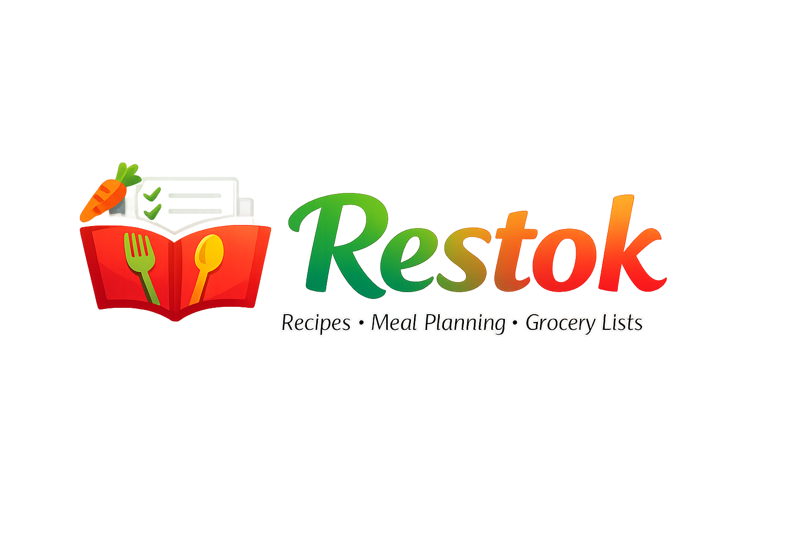

# Restok - Recipe Manager


A bilingual (English/Romanian) recipe management web application with automatic recipe importing, meal planning, shopping lists, pantry inventory, and family sharing.

<p align="center">
  
</p>

## Features

### Recipe Management
- **Import recipes** from 400+ supported websites (AllRecipes, BBC Good Food, Food Network, etc.)
- **Automatic translation** between English and Romanian using Argos Translate
- **Manual recipe creation** with full ingredient and instruction management
- **Collections** to organize recipes into custom groups
- **Favorites & ratings** to quickly find your best recipes
- **Smart filtering** by category, cook time, and rating

### Meal Planning
- **Weekly meal planner** with drag-and-drop interface
- **Generate shopping lists** from meal plans automatically

### Shopping Lists
- **Multiple shopping lists** with real-time sync
- **Smart suggestions** based on meal plans and pantry inventory
- **Category grouping** with custom store layouts
- **Check off items** and add directly to pantry

### Pantry Inventory
- **Track ingredients** at home with storage locations (fridge, freezer, pantry, counter)
- **Expiration alerts** for items expiring within 7 days
- **Low stock tracking** to know when to restock

### Store Management
- **Multiple stores** with custom category ordering
- **Drag-and-drop** category reordering per store
- **Default store** selection for new shopping lists

### Price Tracking
- **Record prices** for ingredients at different stores
- **Price trends** and history visualization
- **Compare prices** across stores

### Family Sharing
- **Create families** and invite members
- **Share recipes**, meal plans, shopping lists, and pantry
- **Real-time sync** across all family members

### Other Features
- **Bilingual UI** - switch between English and Romanian interface
- **Image storage** - recipe images are downloaded and stored locally
- **Multi-user support** with JWT authentication
- **Browser extension** for quick recipe importing

## Tech Stack

| Layer | Technology |
|-------|------------|
| Frontend | Next.js 16, React 19, TypeScript, Tailwind CSS, shadcn/ui |
| Backend | Python 3.12, FastAPI, SQLAlchemy, Pydantic |
| Database | PostgreSQL 16 |
| Translation | LibreTranslate (Argos Translate) |
| Recipe Parsing | recipe-scrapers library |
| Testing | Playwright (E2E) |
| Deployment | Docker Compose |

## Getting Started

### Prerequisites

- Docker and Docker Compose
- Node.js 20+ (for local frontend development)
- Python 3.12+ (for local backend development)

### Quick Start with Docker

1. Clone the repository:

```bash
git clone https://github.com/YOUR_USERNAME/restok.git
cd restok
```

2. Copy the environment file:

```bash
cp .env.example .env
```

3. Start all services:

```bash
docker-compose up -d
```

4. Wait for LibreTranslate to download language models (first run takes ~2-5 minutes).

5. Run database migrations:

```bash
docker-compose exec backend alembic upgrade head
```

6. Access the application:
   - Frontend: http://localhost:3000
   - Backend API: http://localhost:8000/api/docs
   - LibreTranslate: http://localhost:5000

### Local Development

#### Backend

```bash
cd backend
python -m venv venv
source venv/bin/activate  # or `venv\Scripts\activate` on Windows
pip install -r requirements.txt

# Start PostgreSQL and LibreTranslate with Docker
docker-compose up -d db libretranslate

# Run migrations
alembic upgrade head

# Start the server
uvicorn app.main:app --reload
```

#### Frontend

```bash
cd frontend
npm install
npm run dev
```

#### E2E Tests

```bash
cd frontend
npm install
npx playwright install
npm run test:e2e
```

## Project Structure

```
restok/
├── frontend/               # Next.js application
│   ├── src/
│   │   ├── app/           # App router pages
│   │   ├── components/    # React components
│   │   ├── contexts/      # React contexts
│   │   ├── lib/           # Utilities and API client
│   │   └── types/         # TypeScript types
│   ├── e2e/               # Playwright E2E tests
│   └── ...
├── backend/                # FastAPI application
│   ├── app/
│   │   ├── api/           # API routes
│   │   ├── core/          # Config and security
│   │   ├── db/            # Database setup
│   │   ├── models/        # SQLAlchemy models
│   │   ├── schemas/       # Pydantic schemas
│   │   └── services/      # Business logic
│   ├── alembic/           # Database migrations
│   └── ...
├── extension/              # Browser extension
├── docker-compose.yml
└── README.md
```

## API Endpoints

### Authentication
- `POST /api/auth/register` - Register new user
- `POST /api/auth/login` - Login
- `POST /api/auth/refresh` - Refresh access token
- `GET /api/auth/me` - Get current user

### Recipes
- `POST /api/recipes/import` - Import recipe from URL
- `POST /api/recipes` - Create recipe manually
- `GET /api/recipes` - List user's recipes (with filters)
- `GET /api/recipes/{id}` - Get recipe by ID
- `PUT /api/recipes/{id}` - Update recipe
- `DELETE /api/recipes/{id}` - Delete recipe

### Collections
- `GET /api/collections` - List collections
- `POST /api/collections` - Create collection
- `PUT /api/collections/{id}` - Update collection
- `DELETE /api/collections/{id}` - Delete collection

### Meal Plans
- `GET /api/meal-plans` - Get meal plans for date range
- `POST /api/meal-plans` - Add meal to plan
- `DELETE /api/meal-plans/{id}` - Remove meal from plan

### Shopping Lists
- `GET /api/shopping-lists` - List shopping lists
- `POST /api/shopping-lists` - Create shopping list
- `GET /api/shopping-lists/suggestions/smart` - Get smart suggestions
- `POST /api/shopping-lists/{id}/items` - Add item to list

### Pantry
- `GET /api/pantry` - List pantry items
- `POST /api/pantry` - Add pantry item
- `GET /api/pantry/expiring` - Get expiring items

### Stores
- `GET /api/stores` - List stores
- `POST /api/stores` - Create store
- `PUT /api/stores/{id}` - Update store (including category order)

### Prices
- `GET /api/prices` - List price history
- `POST /api/prices` - Record a price
- `GET /api/prices/trends` - Get price trends

### Family
- `GET /api/families/current` - Get current family
- `POST /api/families` - Create family
- `POST /api/families/invite` - Invite member

## Environment Variables

| Variable | Description | Default |
|----------|-------------|---------|
| `DB_PASSWORD` | PostgreSQL password | `restok_secret` |
| `SECRET_KEY` | JWT signing key | (change in production) |
| `NEXT_PUBLIC_API_URL` | Backend API URL | `http://localhost:8000` |

## Screenshots

*Coming soon*

## Contributing

Contributions are welcome! Please feel free to submit a Pull Request.

## License

MIT
